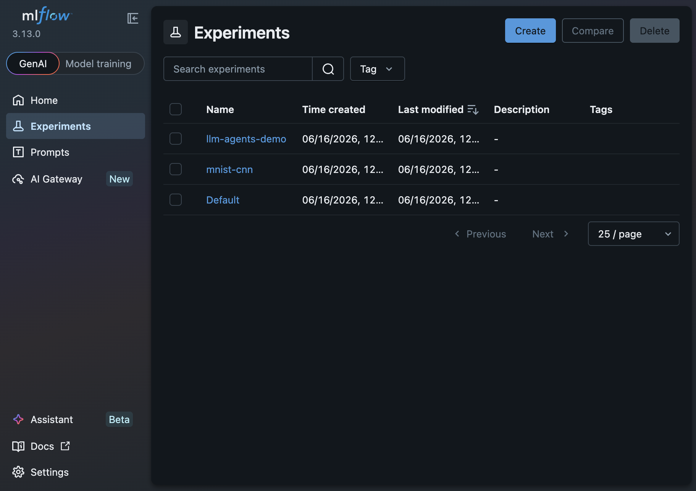
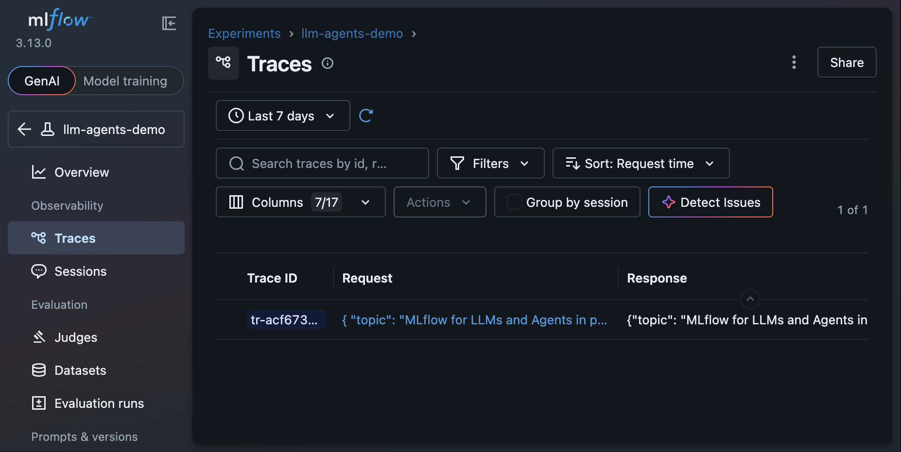
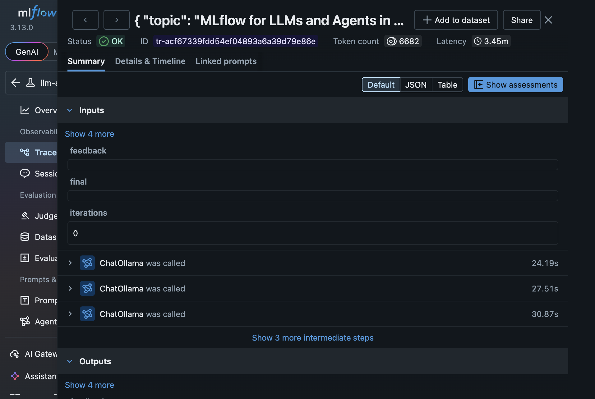
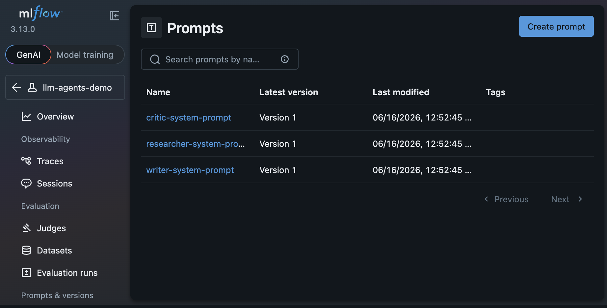
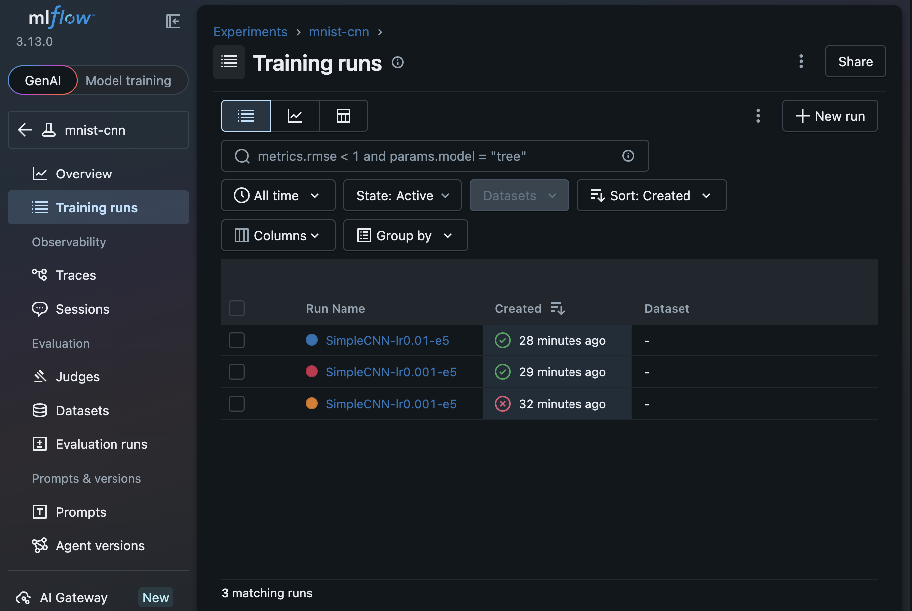
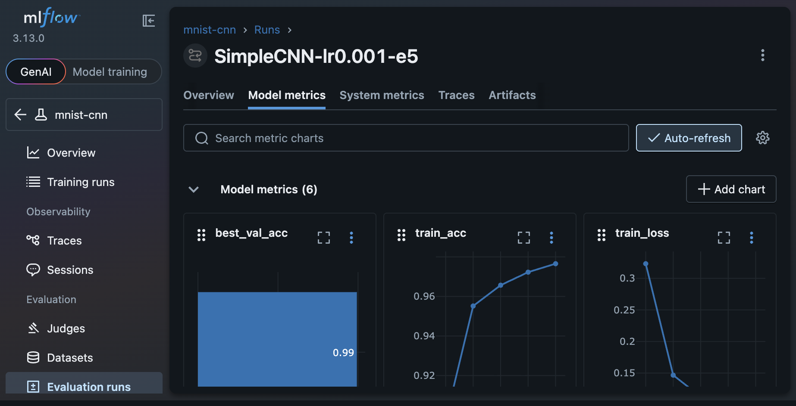
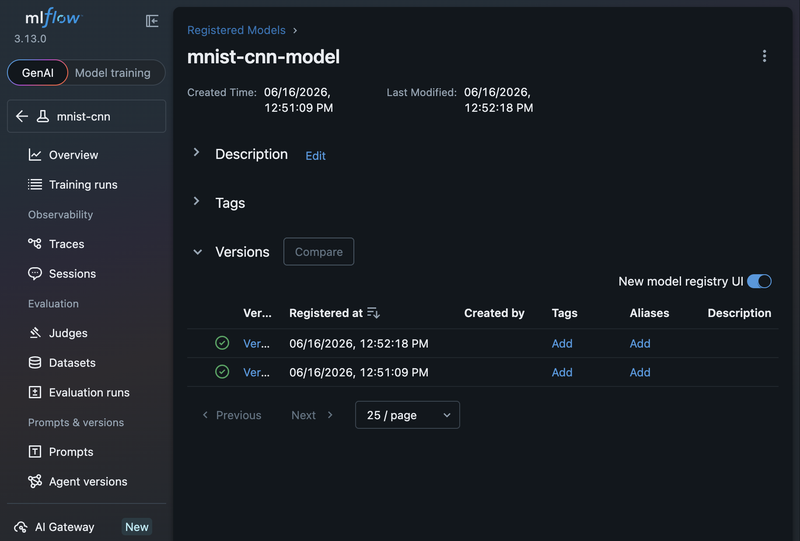
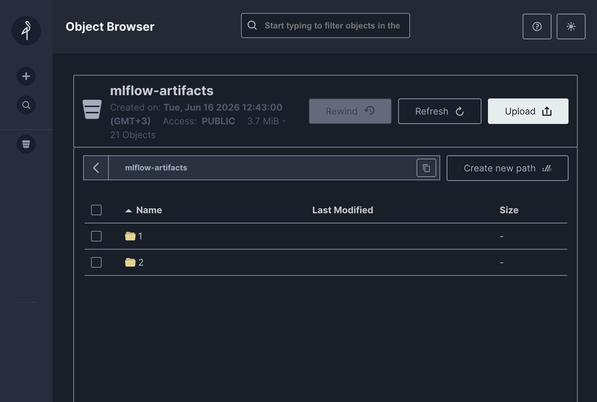

# mlflow-demo

> A production-level MLflow learning project covering both GenAI (LangGraph + Ollama) and Classical ML (PyTorch), with full observability, evaluation, and model registry — all running locally via Docker.

---

## Contents

- [What This Project Covers](#what-this-project-covers)
- [Architecture](#architecture)
- [Project Layout](#project-layout)
- [Prerequisites](#prerequisites)
- [Quick Start](#quick-start)
- [LLMs & Agents](#llms--agents)
- [Model Training](#model-training)
- [Running Tests](#running-tests)
- [Infrastructure Details](#infrastructure-details)
- [MLflow Features Reference](#mlflow-features-reference)
- [Tech Stack](#tech-stack)

---

## What This Project Covers

| Area | MLflow Features |
|---|---|
| **LLMs & Agents** | Autolog tracing, LangGraph observability, Prompt Registry, `mlflow.evaluate()` |
| **Model Training** | Experiment tracking, `pytorch.autolog`, Model Registry, champion/challenger aliases, model serving |
| **Infrastructure** | PostgreSQL backend, MinIO artifact store, Ollama local LLM — all in Docker |

---

## Architecture

```
┌─────────────────────────────────────────────────────────┐
│                     Docker Network                       │
│                                                          │
│  ┌──────────────┐   ┌──────────────┐  ┌─────────────┐  │
│  │   MLflow     │   │  PostgreSQL  │  │    MinIO    │  │
│  │  :5000       │──▶│  :5432       │  │ S3   :9000  │  │
│  │  (tracking   │   │  (backend    │  │ UI   :9001  │  │
│  │   server)    │   │   store)     │  │ (artifacts) │  │
│  └──────────────┘   └──────────────┘  └─────────────┘  │
│         ▲                                               │
│  ┌──────────────┐   ┌──────────────┐                    │
│  │    Ollama    │   │  Your Code   │                    │
│  │  :11434      │   │  (host)      │──────────────────▶ │
│  │  (local LLM) │   │              │                    │
│  └──────────────┘   └──────────────┘                    │
└─────────────────────────────────────────────────────────┘

Host port mappings (adjusted to avoid conflicts):
  MLflow UI     → localhost:5000
  MinIO Console → localhost:9091
  MinIO S3 API  → localhost:9002
  Ollama        → localhost:11434
  PostgreSQL    → localhost:5450
```

---

## Project Layout

```
mlflow-demo/
├── docker-compose.yml         # Full infrastructure stack
├── env.example                # Copy to .env
├── start.sh                   # Start stack + sync Python envs
├── stop.sh                    # Stop stack (--clean to wipe volumes)
│
├── llms-agents/               # LangGraph multi-agent + MLflow GenAI features
│   ├── pyproject.toml
│   ├── src/agents/
│   │   ├── config.py          # MLflow + Ollama configuration
│   │   ├── state.py           # Shared AgentState (TypedDict)
│   │   ├── tools.py           # Custom tools (calculator, search stub)
│   │   ├── nodes.py           # Researcher / Writer / Critic / Reviser nodes
│   │   └── graph.py           # Compiled LangGraph StateGraph
│   ├── scripts/
│   │   └── run_pipeline.py    # End-to-end pipeline runner
│   ├── notebooks/
│   │   ├── 01_tracing_demo.ipynb
│   │   ├── 02_evaluation.ipynb
│   │   └── 03_prompt_registry.ipynb
│   └── tests/
│       └── test_agents.py
│
└── model-training/            # PyTorch CNN + MLflow Classical ML features
    ├── pyproject.toml
    ├── src/training/
    │   ├── config.py          # Dataclass hyperparameter config
    │   ├── dataset.py         # MNIST DataLoader helpers
    │   ├── model.py           # SimpleCNN architecture
    │   ├── train.py           # Training loop with mlflow.pytorch.autolog
    │   └── evaluate.py        # Evaluation + Model Registry promotion
    ├── scripts/
    │   └── run_training.py    # CLI entry point (single run or sweep)
    ├── notebooks/
    │   ├── 01_experiment_tracking.ipynb
    │   └── 02_model_registry.ipynb
    └── tests/
        └── test_training.py
```

---

## Prerequisites

- **Docker Desktop** — [Install](https://docs.docker.com/get-docker/)
- **uv** — fast Python package manager

```bash
# macOS
brew install uv
# or
curl -Ls https://astral.sh/uv/install.sh | sh
```

---

## Quick Start

### 1. Clone and configure

```bash
git clone https://github.com/mshaheryarmalik/mlflow-demo.git
cd mlflow-demo
cp env.example .env
```

### 2. Start the full stack

```bash
./start.sh
```

This single command:
- Starts PostgreSQL, MinIO, MLflow tracking server, and Ollama
- Waits for MLflow to be healthy
- Syncs Python virtual environments for both workspaces
- Prints all service URLs

```
MLflow UI      →  http://localhost:5000
MinIO Console  →  http://localhost:9091  (minioadmin / minioadmin)
Ollama API     →  http://localhost:11434
```



### 3. Stop the stack

```bash
./stop.sh           # stop containers, keep data
./stop.sh --clean   # stop and delete all volumes (full reset)
```

---

## LLMs & Agents

Located in `llms-agents/`. Demonstrates MLflow's GenAI observability stack with a **LangGraph multi-agent pipeline** that researches a topic, writes an article, critiques it, and revises it — all backed by a local Ollama LLM.

### Agent Pipeline

```
START → Researcher → Writer → Critic ──► (iterations < 2?) ──► Reviser → Writer (loop)
                                      └─► END
```

Each node calls Ollama and every LLM call is automatically traced by `mlflow.langchain.autolog()`.

### Run the pipeline

```bash
cd llms-agents
uv run python scripts/run_pipeline.py --topic "LangGraph vs AutoGen"
```

Open **http://localhost:5000** → `llm-agents-demo` experiment → **Traces** tab.



### What gets logged automatically

- Every LangChain/LangGraph LLM call → full input/output trace with latency
- Prompt Registry entries (versioned system prompts for each agent role)
- Run artifacts: `final_article.md`, `research_notes.txt`, `critic_feedback.txt`
- Metrics: `output_word_count`, `iterations_completed`, `latency_seconds`



### Prompt Registry

System prompts for each agent role are versioned in the MLflow Prompt Registry. This gives full lineage — every run links back to the exact prompt version that produced it.



### Notebooks

| Notebook | What it shows |
|---|---|
| `01_tracing_demo.ipynb` | autolog, manual `@mlflow.trace` spans, LangGraph tracing |
| `02_evaluation.ipynb` | `mlflow.evaluate()` with built-in and custom metrics |
| `03_prompt_registry.ipynb` | Registering, versioning, and comparing prompt templates |

---

## Model Training

Located in `model-training/`. Demonstrates MLflow's Classical ML features with a **PyTorch CNN trained on MNIST**.

### Model

`SimpleCNN` — a 2-block convolutional network (Conv → BN → ReLU → MaxPool) with a fully connected classifier head. Achieves **~99.3% validation accuracy** on MNIST in 5 epochs on Apple MPS.

### Run training

```bash
cd model-training

# Single run
uv run python scripts/run_training.py --epochs 5 --lr 1e-3

# Hyperparameter sweep (3 LRs x 2 batch sizes = 6 runs)
uv run python scripts/run_training.py --sweep

# Train + promote best model to champion alias
uv run python scripts/run_training.py --epochs 5 --promote
```

### Experiment Tracking

`mlflow.pytorch.autolog()` captures params, per-epoch metrics, and system info with zero extra code. Additional explicit logging adds training curves, model signature, and input examples.





### Model Registry

Every training run registers the model as `mnist-cnn-model`. Versions are promoted to the `champion` alias after passing an accuracy threshold.

```bash
# Promote latest run to champion (requires val_acc >= 0.98)
uv run python scripts/run_training.py --promote --run-id <RUN_ID>

# Serve the champion model
uv run mlflow models serve \
  -m 'models:/mnist-cnn-model@champion' \
  -p 8080 \
  --env-manager local
```



### Artifact Storage (MinIO)

All artifacts (models, training curves, requirements) are stored in MinIO — an S3-compatible object store. Browse them at **http://localhost:9091**.



### Notebooks

| Notebook | What it shows |
|---|---|
| `01_experiment_tracking.ipynb` | autolog, run comparison, programmatic run search |
| `02_model_registry.ipynb` | version listing, champion promotion, loading by alias, serving |

---

## Running Tests

Tests run without a live MLflow server or GPU — all external calls are mocked.

```bash
# LLMs & Agents
cd llms-agents
uv run pytest tests/ -v

# Model Training
cd model-training
uv run pytest tests/ -v
```

---

## Infrastructure Details

| Service | Internal host | Host port | Credentials |
|---|---|---|---|
| MLflow tracking server | `mlflow:5000` | `5000` | — |
| PostgreSQL | `postgres:5432` | `5450` | mlflow / mlflow |
| MinIO S3 API | `minio:9000` | `9002` | minioadmin / minioadmin |
| MinIO Web Console | `minio:9001` | `9091` | minioadmin / minioadmin |
| Ollama | `ollama:11434` | `11434` | — |

> Host ports are remapped to avoid conflicts with common local services.

### Changing the Ollama model

Edit `OLLAMA_MODEL` in `.env` before starting:

```bash
OLLAMA_MODEL=gemma3:1b      # smaller, faster
OLLAMA_MODEL=llama3.2:3b    # slightly larger
OLLAMA_MODEL=mistral:7b     # higher quality, slower
```

---

## MLflow Features Reference

| Feature | API | Where used |
|---|---|---|
| LangChain autolog | `mlflow.langchain.autolog()` | `llms-agents/scripts/run_pipeline.py` |
| Tracing spans | `@mlflow.trace` | `llms-agents/notebooks/01_tracing_demo.ipynb` |
| Prompt Registry | `mlflow.genai.register_prompt()` | `llms-agents/scripts/run_pipeline.py` |
| LLM Evaluation | `mlflow.evaluate()` | `llms-agents/notebooks/02_evaluation.ipynb` |
| PyTorch autolog | `mlflow.pytorch.autolog()` | `model-training/src/training/train.py` |
| Experiment tracking | `mlflow.log_params/metrics/figure()` | `model-training/src/training/train.py` |
| Model logging | `mlflow.pytorch.log_model()` | `model-training/src/training/train.py` |
| Model Registry | `MlflowClient` + aliases | `model-training/src/training/evaluate.py` |
| Model Serving | `mlflow models serve` | CLI |

---

## Tech Stack

| Tool | Role |
|---|---|
| [MLflow 2.x](https://mlflow.org) | Tracking, registry, evaluation, tracing |
| [LangGraph](https://langchain-ai.github.io/langgraph/) | Multi-agent orchestration |
| [LangChain + Ollama](https://python.langchain.com) | LLM integration |
| [PyTorch](https://pytorch.org) | CNN model training |
| [PostgreSQL 16](https://www.postgresql.org) | MLflow backend store |
| [MinIO](https://min.io) | S3-compatible artifact store |
| [Ollama](https://ollama.com) | Local LLM inference (no API key needed) |
| [uv](https://docs.astral.sh/uv/) | Fast Python package management |
| [Docker Compose](https://docs.docker.com/compose/) | Local infrastructure orchestration |
